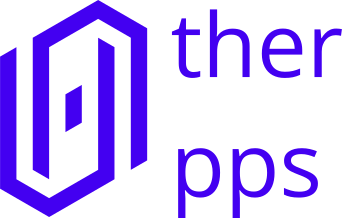
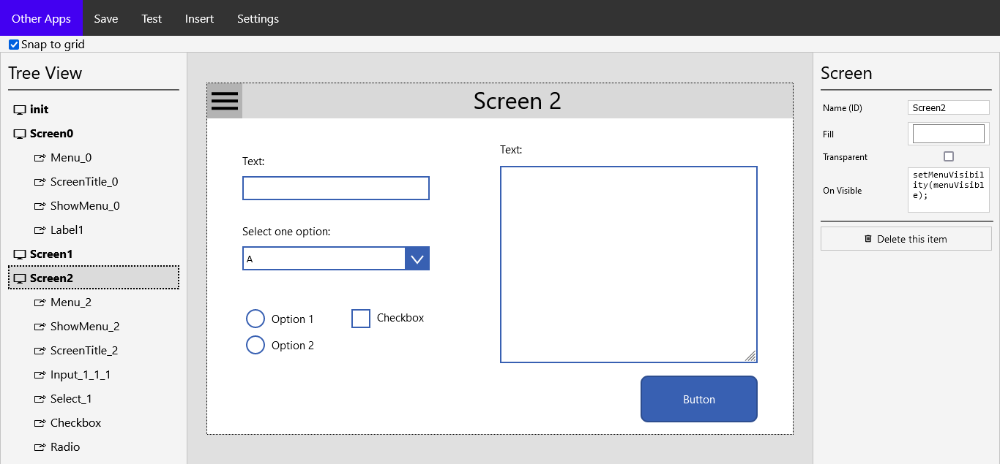
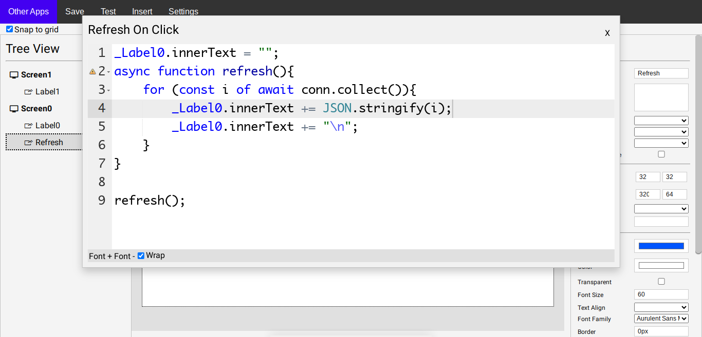

<div align="center">
  
</div>

# Other Apps

Lightweight Free and Open Source alternative to Microsoft's Power Apps written in Python and Flask.

Other Apps works with Javascript and HTML (Instead of that strange language that Power Apps uses), this allows you to do everything you could do in javascript, without limitations.

Disclaimer! Other Apps is still under development. And it is focused for small business/local networks. I do not recommend using it for large enterprises.

<div align="center">
  
  
</div>


## Installation
You need to have Python with virtualenv and Git installed

```bash
  git clone https://github.com/OtherExit/OtherApps.git
  cd OtherApps
  python -m venv venv
  source venv/bin/activate
  pip install flask
  python -m flask run
```

## Future plans
- [ ] Write documentation (I'm on it)
- [ ] Improve the system for creating plugins
- [ ] Interactions with databases
- [ ] Themes

## Scripts used
<a href="https://interactjs.io/">interact.js</a> <br>
<a href="https://github.com/ajaxorg/ace-builds/blob/master/LICENSE">Ace Editor<a>
