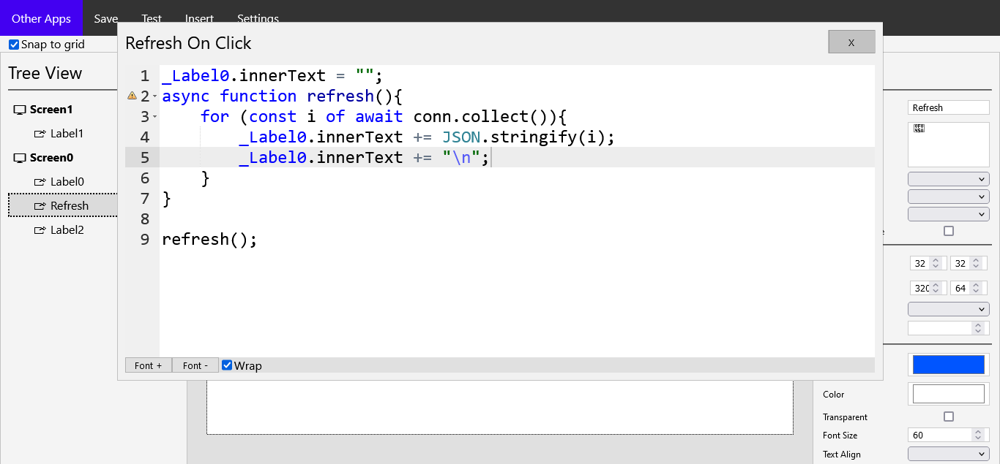
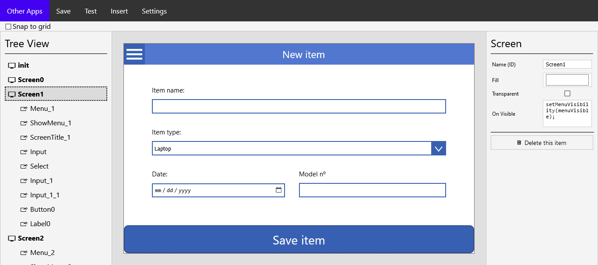
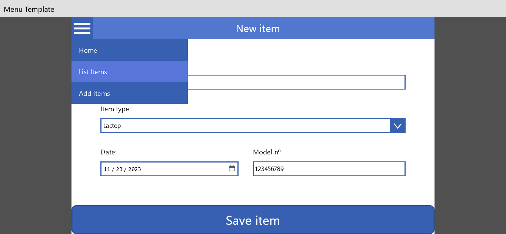

<div align="center">
  
  <h1>Other Apps</h1>
  <p>Lightweight Free and Open Source alternative to Microsoft's Power Apps written in Python and Flask.</p>
</div>
<hr>

[](https://www.gnu.org/licenses/gpl-3.0.en.html)

Use Other Apps to create simple apps for small and resource-poor businesses

## Why Other Apps instead of Power Apps
0. **Other Apps is free and open source**, making it perfect for developers to customize the application to their own liking.
1. **Other Apps makes 0 connections to the internet**, unless you tell it to make a connection of course.
2. **Self-Hosting**, once you download Other Apps, it's yours to do whatever you want
3. **No dependencies**, Other Apps works with pure javascript. No npm, nodejs, jsquery ... needed
4. **IT'S FREE**

Disclaimer! Other Apps is still under development. And it is focused for small business/local networks. I do not recommend using it for large enterprises.

## Features

-   [x] No Ads
-   [x] No Tracking
-   [x] Lightweight
-   [x] No account needed
-   [x] Unrestricted HTML embedding
-   [x] Themes
-   [x] Addons
-   [x] Documentation

## Other Apps + Libre Lists
Get more out of Other Apps with Libre Lists.

### Libre Lists features
-   [x] SQLite databases
-   [x] Unlimited database size

Download [Libre Lists](https://github.com/AdrBog/LibreLists)

Read the [documentation](docs/Libre%20Lists%20Connection.md) to learn how to connect Other Apps with Libre Lists

## Screenshots



 


## Installation
You need to have Python with virtualenv and Git installed

```bash
git clone https://github.com/AdrBog/OtherApps.git
cd OtherApps
python -m venv venv
source venv/bin/activate
pip install flask flask-cors xmlschema
python -m flask run -p 5000
```

## Help
If you need help, you can read the [documentation](https://github.com/AdrBog/OtherApps/tree/main/docs) or see the [examples](https://github.com/OtherExit/OtherApps-Examples)
