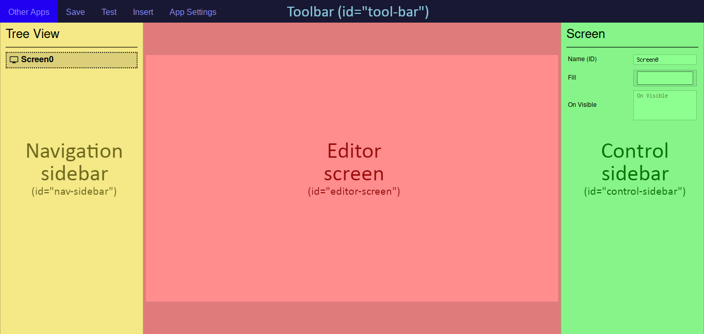
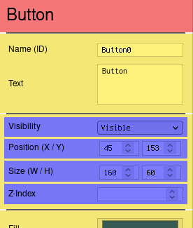

# 3 - Editor

OtherApps's editor is separated into four main parts:

  

- **Toolbar**: A tool menu to manage the application. Here you can save your app, test your app, add objects to the screen and change the preferences of your application.
- **Navigation sidebar**: Here you can switch between screens, double click to display or hide the objects of a screen.
- **Editor screen (or screen editor)**: Here you can more easily manipulate objects on the screen, this includes moving and resizing objects.
- **Control sidebar**: Here you can change the properties of the selected object, in the following section the control sidebar will be explained in more detail.

## 3.1 Control sidebar

The Control sidebar is divided in three parts:

  

- **Header (red)**: This shows the type of object you currently have selected: There are three types: screens, labels and buttons.
- **Group of options (yellow)**: The IDs of group of options usually have the next format "table-XXX-options".
- **Individual options (blue)**: The IDs of the individual options usually have the next format "edit-info-XXX".

Depending on the type of object you select, the control sidebar will change its options to edit
- **Screens, Labels and Buttons:**
  - **Id options** *(id="table-id-options")*:
    - **Name (ID)** *(id="edit-info-name")*: This option allows you to edit the object's id, there cannot be two objects with the same id.
- **Labels and Buttons:**
  - **Text options** *(id="table-text-options")*:
    - **Text** *(id="edit-info-text")*: This option allows you to change the text to be displayed, by default it is "Text" for labels and "Button" for buttons.
  - **Show options** *(id="table-show-options")*
    - **Visibility** *(id="edit-info-visible")*
    - **Position**:
      - **X** *(id="edit-info-x")*
      - **Y** *(id="edit-info-y")*
    - **Size**:
      - **Width** *(id="edit-info-w")*
      - **Height** *(id="edit-info-h")*
    - **Z-index** *(id="edit-info-z")*
  - **Decoration options** *(id="table-decor-options")*:
    - **Fill** *(id="edit-info-fill")*: This options allows you to change the background color of the object.
    - **Color** *(id="edit-info-color")*: This options allows you to change the text color of the object.
    - **Font Size** *(id="edit-info-font-size")*: This options allows you to change the font size of the object.
    - **Font Family** *(id="edit-info-font-family")*: This options allows you to change the font of the object.
    - **Border** *(id="edit-info-border")*: This options allows you to change the css border style of the object.
    - **Border Radius** *(id="edit-info-border-r")*: This options allows you to change the border radius of the object.
    - **Background Image** *(id="edit-info-bgimage")*: This options allows you to change the background image of the object, write url("URL OF THE IMAGE") to add a background.
- **Only Screens:**
  - **Screen options** *(id="table-screen-options")*:
    - **Fill** *(id="edit-info-bgcolor")*: Here you can change the screen background color
    - **On Visible** *(id="edit-info-onvisible")*: Here you can set the javascript code to execute when you enter the screen.
- **Only Buttons:**
  - **Button options** *(id="table-button-options")*:
    - **On Click** *(id="edit-info-onclick")*: Here you can set the javascript code to execute when the button is clicked.

Tips: Double click on the textareas to open the advanced code editor.
