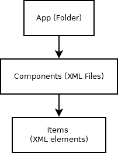
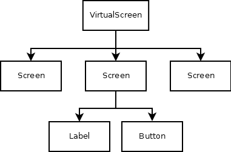

# Structure of an Other Apps application

Before reading this article, you should read this one first:
[Manage Projects](Manage%20Projects.md)

## Table of contents
- [Glossary of definitions](#glossary-of-definitions)
- [The Apps](#the-apps)
- [The Components](#the-components)
- [The Items](#the-items)

## Glossary of definitions

| Name | Meaning |
|--|--|
| **App** | Set of components that make up an Other Apps application. <br> Not to be confused with the web application itself, which is Other Apps.
| **Component** | Set of items in which the user interacts with them.
| **Item** | These are the elements that make up a component.<br> They can be **Screens** or **Childrens**
| **Screen** | A component is divided into screens, which the user can access when executing an action. <br> 
| **Children** | These are the items that make up a screen. <br> They can be **Labels** or **Buttons**
| **Label** | Childrens whose function is to display or receive information, this can be text, iframes or inputs.
| **Button** | Childrens whose function is to execute an action when the user clicks on them.



## The Apps
The apps are the folders located in **PROJECTS_DIR**

When we talk about the **app id**, we are referring to the name of the folder stored in **PROJECTS_DIR**

PROJECTS_DIR/APP_ID

Sometimes the **app id** is also referred to as the **app name**, but it should not be confused with the **displayname** attribute.
## The Components

The components are XML files located in the application directory. 

To create/edit a component in the editor, add this URL parameter to the link
```txt
/edit/APP_ID?c=COMPONENT_NAME
```
This will create a new XML file in the following location
**PROJECTS_DIR/APP_ID/COMPONENT_NAME.xml**

There are two reserved names that you should not use when creating a component
- **1**: This is the main component, the one that is edited and executed by default.
- **test**: This is the component that is used for testing while editing the application.

Components can help you reuse a set of items several times within the application.

You can add components to your application using an iframe with the following src attribute:

```html
<iframe src="/embed/APP_ID/COMPONENT_NAME"></iframe>
```

## The Items

From a web programmer's point of view, items are nothing more than divs placed on top of each other.



The **VirtualScreen** is the default **root**, from which the rest of the screens hang. This root sets the properties of the rest of the screens, such as height and width.<br>I don't remember why i called it VirtualScreen.

Click [here](Manage%20Projects.md) to see how this structure is represented within the XML file

